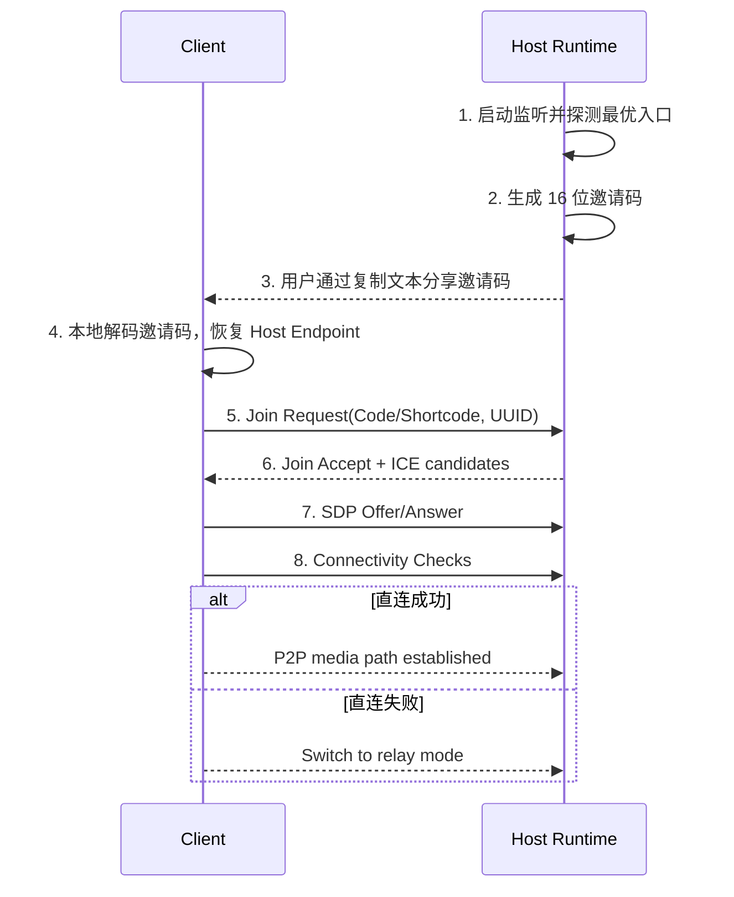

# 网络连通与 NAT 策略（MVP）

## 目标

- 在“无业务云后端”约束下，最大化语音连通率
- 明确不同网络环境下的接入策略与降级路径

## 网络环境分级

- Level 1：同局域网（成功率最高）
- Level 2：公网可端口映射（成功率较高）
- Level 3：复杂 NAT/企业网络（成功率不稳定）

## 连接策略

1. **统一邀请码接入**：所有场景统一使用 16 位自描述邀请码，加入端本地解码后直接连接房主。
2. **最优入口选择**：房主运行时优先选择“公网映射入口 > 公网直连入口 > 局域网入口”，并把该入口写入邀请码。
3. **公网地址 + 自动端口映射**：房主运行时优先尝试通过 **UPnP / NAT-PMP / PCP** 自动申请端口映射，降低房主手动配置成本。
4. **公网地址 + 手动端口映射**：自动映射失败时，回退到用户手动配置路由器端口映射，并在邀请码可用性提示中明确标识。
5. **房主中转兜底**：P2P 直连建立失败时，将媒体流切向房主节点的监听端口（要求该端口至少对外可达）。
6. **明确错误与排障**：仍失败则向用户展示具体网络错误（如“房主端口不可达”、“对称 NAT 阻断”、“邀请码已过期”、“当前邀请码仅同网可用”）及排障建议。

## 会话建立流程

系统不引入共享发现服务。Host Runtime 启动后，先完成监听、入口探测、端口映射与自检，再把最终可用入口编码为统一邀请码。

## 失败类型与处理

- 邀请码过期或校验失败：提示重新获取邀请码
- 房主地址不可达：提示检查公网 IP/端口映射/防火墙
- ICE 协商超时：自动切换中转并重试一次
- 连上后抖动高：降码率、提高缓冲窗口、提示网络质量

## 提速与稳态策略

- **建房阶段**
  - 监听端口、端口映射、公网 IP 探测并行执行
  - 仅在“监听成功 + 至少一次入口自检完成”后展示邀请码
  - 复用上次成功端口，减少随机端口带来的映射波动
- **入房阶段**
  - 邀请码本地解码，无需额外发现查询
  - 连接前先做 TTL 与校验检查，避免无效连接尝试
  - WebSocket 连接采用短超时 + 小次数快速重试
- **运行阶段**
  - 维持轻量心跳与入口健康探测
  - 若房主入口状态变化，立即重新签发邀请码并更新 UI

## 运营现实

- 纯无云模式无法覆盖所有复杂 NAT 场景
- 16 位邀请码解决的是“发现与入口传递”问题，不解决复杂 NAT 下的公网不可达问题
- 若追求“接近 Discord 体验”，应预留轻量 STUN/TURN 接入能力
