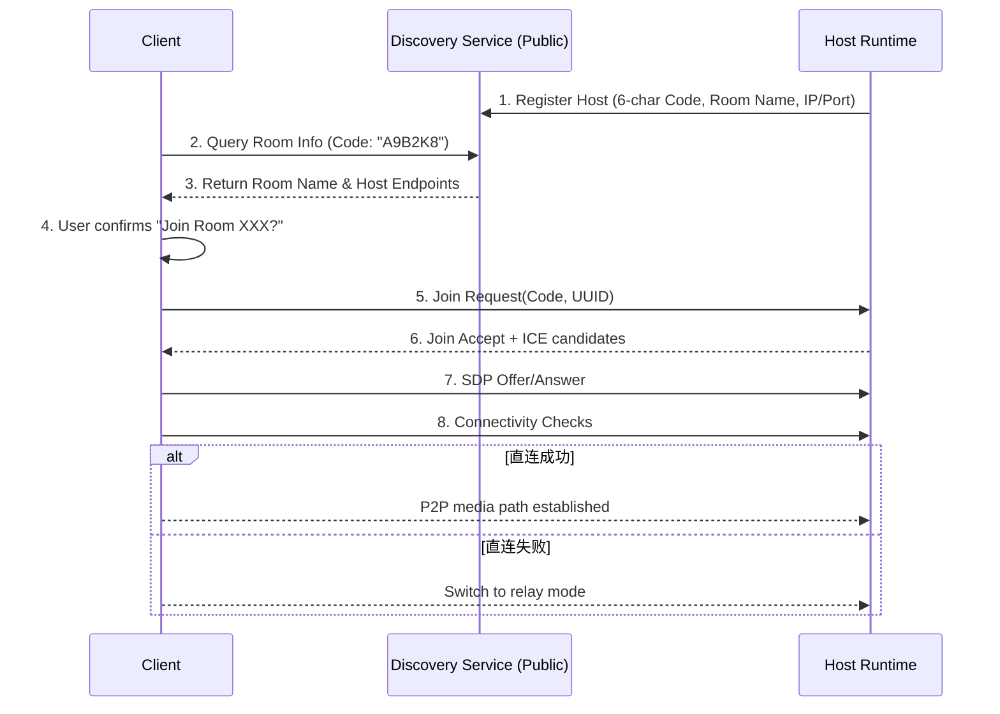

# 网络连通与 NAT 策略（MVP）

## 目标

- 在“无业务云后端”约束下，最大化语音连通率
- 明确不同网络环境下的接入策略与降级路径

## 网络环境分级

- Level 1：同局域网（成功率最高）
- Level 2：公网可端口映射（成功率较高）
- Level 3：复杂 NAT/企业网络（成功率不稳定）

## 连接策略

1. **局域网发现与直连**：利用 mDNS/Bonjour 实现同网段内快速发现房主节点。
2. **公网地址 + 自动端口映射**：房主运行时优先尝试通过 **UPnP / NAT-PMP** 协议向家用路由器自动申请端口映射，降低房主手动配置成本。
3. **公网地址 + 手动端口映射**：自动映射失败时，回退到用户手动配置路由器端口映射，并提供直连 IP。
4. **房主中转兜底**：P2P 直连建立失败时，将媒体流切向房主节点的监听端口（要求该端口至少对外可达）。
5. **明确错误与排障**：仍失败则向用户展示具体网络错误（如“房主端口不可达”、“对称 NAT 阻断”）及排障建议。

## 会话建立流程

引入轻量级公网发现服务（Discovery Service），用于实现 6 位 Code 到具体连接地址的映射。

## 失败类型与处理

- 房主地址不可达：提示检查公网 IP/端口映射/防火墙
- ICE 协商超时：自动切换中转并重试一次
- 连上后抖动高：降码率、提高缓冲窗口、提示网络质量

## 运营现实

- 纯无云模式无法覆盖所有复杂 NAT 场景
- 若追求“接近 Discord 体验”，应预留轻量 STUN/TURN 接入能力
