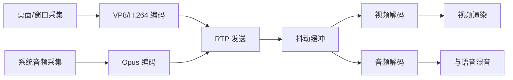

# 实时语音与媒体链路设计（MVP）

## 媒体技术选型

- 传输与会话：WebRTC
- 编解码：音频 Opus，视频 VP8/H.264 (用于屏幕共享)
- 加密：DTLS-SRTP（WebRTC 默认）
- 音频处理：AEC、NS、AGC 使用 WebRTC 内建能力

## 音频链路

## 建议默认参数（音频）

- 采样率：48kHz
- 声道：单声道优先
- 帧长：20ms
- 初始码率：24–32kbps/人
- DTX：开启（降低静音带宽）

## 屏幕共享链路与参数

- **目标观感**：接近直播推流（高帧率、低延迟）
- **推荐档位**：
  - 流畅优先：720p @ 30fps，码率 1.5Mbps ~ 2.5Mbps
  - 高清电竞：1080p @ 60fps，码率 3Mbps ~ 6Mbps
- **系统音频采集**：
  - Windows：使用 `getDisplayMedia` 结合 `systemAudio: 'include'`
  - macOS：需依赖系统级机制（如 ScreenCaptureKit 或黑路音频虚拟驱动）
- **降级策略（Simulcast/SVC）**：建议开启 Simulcast，弱网用户接收低码率流，避免单个弱网用户拖垮全体体验。

## 屏幕共享采集与推流骨架（Phase 5.3）

- 采集入口：`navigator.mediaDevices.getDisplayMedia`。
- 质量预设：
  - `720p`: `1280x720@30fps`
  - `1080p`: `1920x1080@60fps`
  - `原画`: 使用系统默认采集参数
- 推流策略：
  - 若 PeerConnection 已存在视频 sender，则执行 `replaceTrack(screenTrack)`。
  - 若不存在视频 sender，则执行 `addTrack(screenTrack)`。
- 结束处理：监听 `videoTrack.onended`，触发 UI 状态回收和轨道清理。

## 用户可控项

- 输入设备与输出设备切换
- 麦克风增益与输入灵敏度
- 按键说话（PTT）开关
- 语音激活阈值（VAD threshold）

## 性能与质量指标

- **目标时延：<100ms**（良好网络下，以满足高要求电竞场景）
- 抖动容忍：<30ms 时基本平稳
- 丢包策略：优先语音连续性，允许轻微失真
