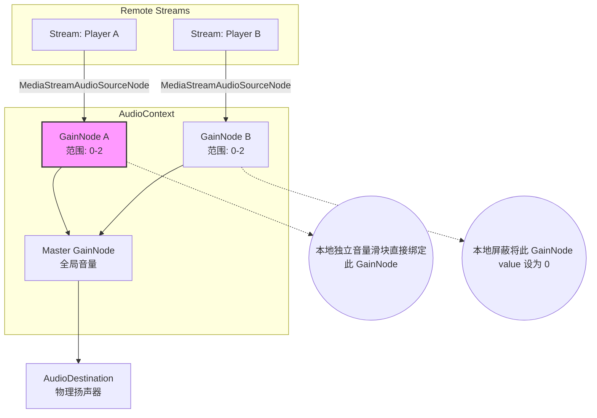

# 音频路由与多层级控制引擎

为了实现 PRD 中要求的“全局音量”、“本地单独调节某人音量”和“本地屏蔽”，我们在前端需要使用 Web Audio API 对每路远端音频流进行精确的路由与增益控制。

## 1. Web Audio API 拓扑图

该拓扑展示了从接收到多个成员的远端音频流，到最终混音输出至物理扬声器的完整链路。

## 2. 状态与控制分离设计

在电竞开黑场景中，必须严格区分 **“我不想听他的声音”** 和 **“房主不让所有人听他的声音”** 这两种逻辑。

### 2.1 本地屏蔽 (Local Mute) 与 独立音量调节
- **作用域**：仅影响当前执行操作的客户端。
- **实现机制**：通过调节目标用户对应的 `GainNode.gain.value`。
  - 音量调节：滑块值映射为 `0.0` 到 `2.0` 的浮点数。
  - 屏蔽（Mute）：将该值直接设为 `0.0`，并在 UI 状态中记录屏蔽标记。
- **网络开销**：不产生任何网络信令，纯本地计算。

### 2.2 房主全局闭麦 (Server Mute / Host Mute)
- **作用域**：影响房间内所有人。
- **实现机制**：
  1. 房主在 UI 点击“全局强制闭麦”。
  2. 房主客户端向 Host Runtime 发送 `{type: "HOST_MUTE", target: uuid, state: true}`。
  3. Host Runtime 向全体成员广播该状态。
  4. **被闭麦者**的客户端收到状态后，强制执行 `localAudioTrack.enabled = false`，从源头切断采集。
  5. **其他成员**的客户端收到状态后，在 UI 列表中将被闭麦者的麦克风图标置为“红色被锁”状态。

### 2.3 中置控制条中的本地输入/输出控制
- **麦克风开关**：直接绑定本地采集轨道的 `enabled` 状态，用于快速闭麦/开麦。
- **麦克风音量**：绑定本地输入增益（可映射为本地 `GainNode` 或 `MediaTrackConstraints` 增益参数）。
- **扬声器开关与音量**：继续作用于本地播放链路，不影响其他成员听感。
- **交互边界**：中置控制条仅影响当前客户端的本地设备行为，不应发出全局控制信令。

### 2.4 本地设备采集与设备列表同步（Phase 4.2）
- **采集入口**：设置面板触发 `navigator.mediaDevices.getUserMedia({ audio, video: false })` 获取本地麦克风流。
- **设备枚举**：通过 `enumerateDevices()` 同步输入/输出设备下拉列表，并记录默认设备。
- **热更新监听**：监听 `mediaDevices.devicechange`，自动刷新设备列表，避免插拔后 UI 过期。
- **失败处理**：采集失败时保留错误状态并展示错误信息，不影响房间其他功能。
