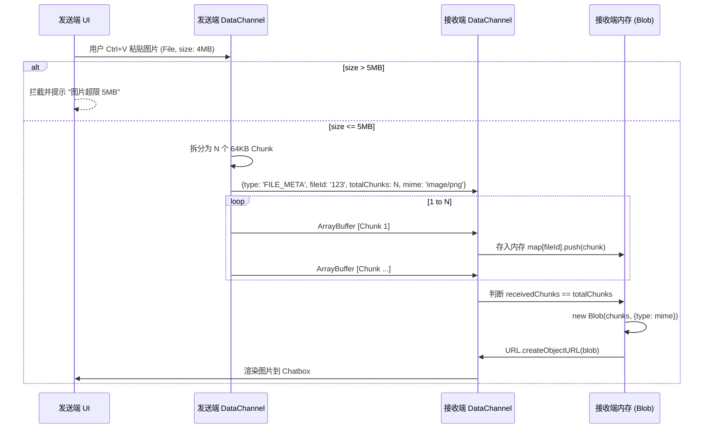

# 基于 DataChannel 的图片分片传输

由于 WebRTC DataChannel 默认对单条消息有大小限制（通常安全值为 16KB - 64KB），而 PRD 要求支持最大 5MB 的图片传输，因此必须在应用层实现**二进制分片（Chunking）与重组**协议。

## 1. 为什么不走信令通道 (WebSocket) 传图片？
如果将 5MB 的图片转为 Base64 并通过 Host Runtime 的 WebSocket 广播，会导致：
1. Base64 编码增加 33% 体积。
2. 瞬间的大包会阻塞 WebSocket 的缓冲区，导致后续的 `MUTE` 或 `ICE_CANDIDATE` 等高优控制信令排队延迟。
3. 给房主节点的 CPU 与带宽带来不必要的转发压力（如果是 P2P Mesh 拓扑，图片应尽可能直连发送）。

## 2. 传输分片时序图

该时序图展示了发送端将大文件切片、发送元数据、循环发送二进制流，并在接收端重组渲染的完整过程。



## 3. 分片协议数据结构

### 3.1 元数据帧 (JSON 字符串)
发送任何文件前，先通过 DataChannel 发送一条标识帧：
```json
{
  "type": "FILE_META",
  "fileId": "uuid-v4-string",
  "fileName": "screenshot.png",
  "mimeType": "image/png",
  "fileSize": 4194304,
  "totalChunks": 64
}
```

### 3.2 数据帧 (ArrayBuffer)
发送完元数据后，立刻循环发送二进制块。为了区分，可以在每个 Chunk 的头部增加几个字节的 Header（例如 `[fileId(16 bytes)][chunkIndex(4 bytes)][data]`），或者更简单地依赖 WebRTC 的底层有序传输保证，仅根据收到的二进制块数量计数。

## 4. 边界与并发限制
- **并发发送限制**：DataChannel 队列中同一时间最多允许 2 个文件处于传输中状态。
- **内存防爆**：接收端需设置超时机制（如 30 秒内未收齐 `totalChunks`），则丢弃已接收的该 `fileId` 下的所有内存块，防止残缺文件堆积导致 OOM。