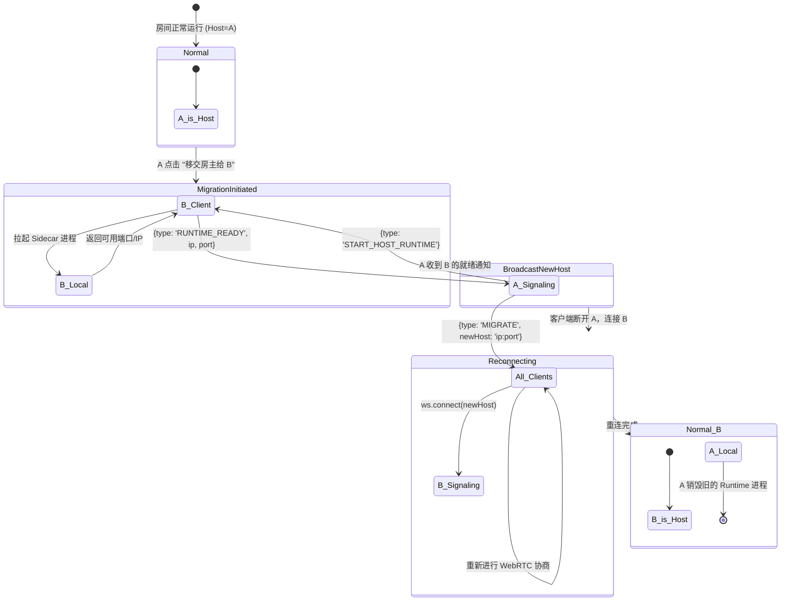

# 房主热迁移与安全边界防御

本文档详细描述在无中心化业务云服务器的架构下，如何处理最复杂的“房主移交”状态流转，以及作为个人节点承担“微型服务器”角色时应具备的最小安全防御策略。

## 1. 房主热迁移机制 (Host Migration)

目的是在旧房主主动移交时，平滑地将会话中心转移到新的节点，而不需要大家手动复制新的口令重新进房。

### 1.1 状态流转机制

### 1.2 异常中断处理
如果在 `MigrationInitiated` 阶段，B 的机器无法拉起进程或无法打通公网端口（超时 5 秒），A 需中止迁移流程，并向房间广播“移交失败：目标网络受限”。

### 1.3 状态机实现骨架（Phase 5.4）
- 使用 `HostMigrationMachine` 承载状态推进，避免分散在多个回调中导致分支漂移。
- 关键状态迁移：
  - `Normal -> MigrationInitiated`
  - `MigrationInitiated -> BroadcastNewHost`
  - `BroadcastNewHost -> Reconnecting`
  - `Reconnecting -> Normal(新房主)`
- 失败迁移：
  - `MigrationInitiated -> Failed(TARGET_RUNTIME_TIMEOUT)`
  - `MigrationInitiated -> Failed(自定义原因)`

---

## 2. 安全与边界防御

房主机器直接暴露在公网，虽然只有拿到口令的人才能进房间，但也必须在协议层做好基础的防御。

### 2.1 WebSocket 连接频率控制 (Rate Limiting)
- **风险**：恶意成员编写脚本高频发送 `CHAT_MESSAGE` 或 `ICE_CANDIDATE` 打满房主带宽或 CPU。
- **策略**：
  - Host Runtime 内存中记录每个 UUID 的包接收时间戳。
  - 限制：信令消息最大处理频率为 10条/秒。
  - 惩罚：超过阈值直接断开该 UUID 的 WebSocket 连接（并在本地记录警告）。

### 2.2 黑名单拦截 (Blacklist Check at Handshake)
- **风险**：被踢出并拉黑的人不断尝试重连，浪费 WebSocket 握手资源。
- **策略**：
  - 房主 Runtime 维护一个 `Set<UUID>` 的内存结构（同步持久化到本地 JSON）。
  - 拦截点前置到 **HTTP Upgrade 阶段**：解析 `ws://ip:port?uuid=xxx`。
  - 若 `xxx` 存在于黑名单中，服务端直接返回 `HTTP 403 Forbidden` 拒绝协议升级。

### 2.3 P2P 降级与中转限流
- 房主不仅承担信令，还在别人直连失败时承担媒体中转（TURN）。
- 房主需监控本机的 CPU 占用。若 `Host Runtime` 进程 CPU > 10% 或带宽出口 > 10Mbps，拒绝接受新的中转请求，直接向请求方回复 `RELAY_REJECTED`。
