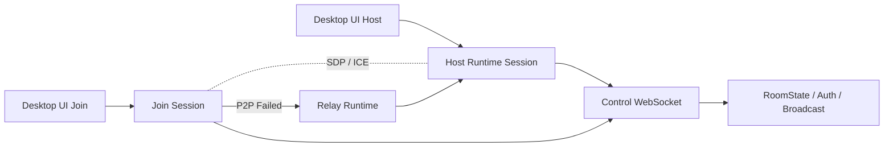

# Windows 优先的真实房间互通方案（Plan A）

## 背景

- 当前 0.2.0 已完成邀请码、入口探测、NAT 映射与 Relay Fallback 的首版能力。
- 但当前桌面端 `App.tsx` 仍以本地 UI 状态模拟“创建房间 / 加入房间 / 成员列表”，并未真正驱动跨设备信令与媒体链路。
- 这导致：
  - macOS 建房、Windows 加入时，即使邀请码解析成功，也不代表真正完成远端会话建立。
  - Windows 建房失败时，缺少足够的运行时日志与真实 Host Runtime 状态面。

## 根因分类

### 1. 入口层问题

- 历史实现中曾使用本机回环地址或仅本地缓存房间元数据，导致跨设备无法解析到正确入口。
- 监听端口若仅绑定回环地址，则其他设备永远无法接入。
- NAT 映射与局域网入口选择仍是“单入口单次决策”，缺少多候选入口与连接回退状态机。

### 2. 控制面问题

- 目前前端加入确认后，仍使用本地模拟成员列表进入频道页。
- 未真正建立 `Host Runtime <-> Join Client` 的长连接控制通道。
- 未将 Rust `RoomState / SignalingMessage / WebRtcRelayRouter / HostAuthGate` 接到真实前端会话。

### 3. 媒体面问题

- P2P / Relay 状态目前主要是 UI 展示与策略骨架，未与真实 PeerConnection 生命周期闭环。
- Offer / Answer / ICE 透传虽有 Rust 结构与单测，但前端尚未完成真实协商接线。

### 4. Windows 平台问题

- Windows 是主力平台，必须把“Host Runtime 可启动”“防火墙/端口失败可诊断”“房间入口可验证”放在最高优先级。
- Windows 发布版对 NAT 映射做了兼容降级，因此必须优先保证：
  - 局域网入口真实可用
  - 无 NAT 映射时能清晰落到 Relay / 排障路径
  - 失败日志可导出

## 重构目标

- 将“UI 原型房间”重构为“真实 Runtime 驱动房间”。
- 保持“无业务云后端”的前提不变。
- 以 **Windows Host / Windows Join / Windows <-> macOS 互通** 为第一验收目标。

## 无云约束下的最优设计

- 不引入中心化房间注册、中心化信令服务、TURN 服务。
- 所有互通能力都建立在：
  - 统一邀请码
  - 房主本地 Host Runtime
  - 真实控制面长连接
  - 房主本地 Relay 兜底
  - 多候选入口回退
- 因此“最优设计”不再等同于“公网命中率最高”，而是：
  - 同网成功率最高
  - 可映射网络下自动提升命中率
  - 不可映射时失败可诊断、可快速回退

## 目标架构

## 关键设计决策

### A. 分离“房间 UI 状态”与“真实会话状态”

- 前端禁止再以本地 `localStorage room registry` 作为加入成功依据。
- 前端所有频道态必须来源于真实 Runtime 回包：
  - `HOST_RUNTIME_READY`
  - `JOIN_ACCEPTED`
  - `ROOM_STATE`
  - `MEMBER_JOINED`
  - `MEMBER_LEFT`

### B. Host Runtime 显式状态机

- 新增 Host Runtime 生命周期：
  - `Idle`
  - `Binding`
  - `Ready`
  - `AcceptingJoin`
  - `Relaying`
  - `Failed`
- UI 只在 `Ready` 后显示邀请码。
- 任何 `Failed` 都必须带错误码与日志片段。

### C. Join Session 显式状态机

- 新增 Join 生命周期：
  - `InviteParsed`
  - `PreflightChecking`
  - `ControlConnected`
  - `Authorized`
  - `PeerNegotiating`
  - `Connected`
  - `RelayFallback`
  - `Failed`
- UI 错误提示必须来自状态机，而非单纯 `catch -> alert`。

### D. 多候选入口模型

- 单个邀请码后续需支持“候选入口集”而不是只保存一个入口。
- 入口优先级：
  1. 公网映射入口
  2. 局域网 IPv4 入口
  3. 房主本地 Relay 入口
- 当前第一阶段先不扩展邀请码格式，先在 Host Runtime 内部生成入口列表并串行尝试。

### E. Windows 优先日志面

- 必须提供三层日志：
  - UI 运行时日志
  - Tauri/Rust Runtime 日志
  - 会话级诊断摘要
- 最小要求：
  - Windows 用户点击“复制诊断日志”即可拿到建房/入房链路摘要
  - 日志中包含本机 IP、监听端口、探测结果、授权状态、P2P/Relay 决策

## 方案 A 的实施顺序

### Phase A1：真实控制面接线

- 让 Host 端真正启动控制面服务。
- Join 端真正连接到 Host Runtime。
- 用真实 `JOIN_ROOM / ROOM_STATE / MEMBER_JOINED / MEMBER_LEFT` 替换本地模拟状态。
- 所有加入成功状态必须以 Runtime 回包为准，而不是本地 room registry。

### Phase A2：真实协商接线

- 前端接入 Offer / Answer / ICE 透传。
- 打通一对一最小语音链路。
- 将 P2P 失败切换到现有 RelayFallbackEngine 决策。

### Phase A3：Windows 优先诊断

- Tauri 文件日志。
- 导出诊断包。
- Host 防火墙 / 端口 / NAT 映射失败的分类提示。

### Phase A4：跨平台验收

- Windows Host -> Windows Join
- Windows Host -> macOS Join
- macOS Host -> Windows Join
- 无 VPN 局域网 / 家宽 NAT / 失败回退三类场景

## 当前阶段结论

- 最优方向不是继续微调邀请码 UI，而是尽快把 **真实 Host/Join Runtime** 接起来。
- 方案 A 应作为 0.2.1 的最高优先级开发主线。
